# Creating Web API in ASP.NET Core 2.0

## Introduction

Let's create a Web API with the latest version of ASP.NET Core and Entity Framework Core.

In this guide, we'll use WideWorldImporters database to create a Web API.

REST APIs provide at least the following operations:

* GET
* POST
* PUT
* DELETE

There are other operations for REST, but they aren't necessary for this guide.

Those operations allow clients to perform actions through REST API, so our Web API must contain those operations.

WideWorldImporters database contains 4 schemas:

Application
Purchasing
Sales
Warehouse

In this guide, we'll work with Warehouse.StockItems table. We'll add code to work with this entity: allow to retrieve stock items, retrieve stock item by id, create, update and delete stock items from database.

The version for this API is 1.

This is the route table for API:

|Verb|Url|Description|
|----|---|-----------|
|GET|api/v1/Warehouse/StockItem|Retrieves stock items|
|GET|api/v1/Warehouse/StockItem/id|Retrieves a stock item by id|
|POST|api/v1/Warehouse/StockItem|Creates a new stock item|
|PUT|api/v1/Warehouse/StockItem/id|Updates an existing stock item|
|DELETE|api/v1/Warehouse/StockItem/id|Deletes an existing stock item|

Keep these routes in mind because API must implement all routes.

## Prerequisites

Software

* .NET Core
* NodeJS
* Visual Studio 2017 with last update
* SQL Server
* WideWorldImporters database

Skills

* C#
* ORM (Object Relational Mapping)
* TDD (Test Driven Development)
* RESTful services
    
## Using the Code

For this guide, the working directory for source code is C:\Projects.

### Step 01 - Create Project

Open Visual Studio and follow these steps:

    Go to File > New > Project
    Go to Installed > Visual C# > .NET Core
    Set the name for project as WideWorldImporters.API
    Click OK

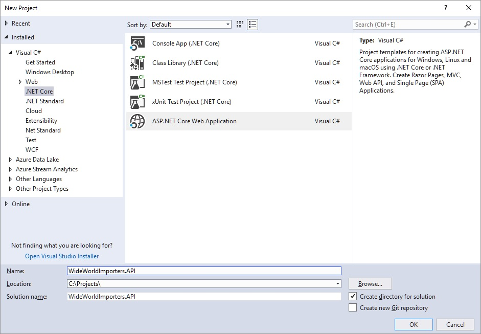

In the next window, select API and the latest version for .ASP.NET Core, in this case is 2.1:

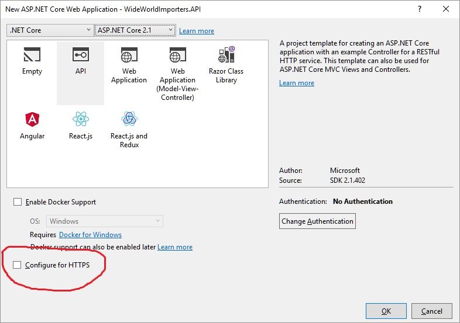

Once Visual Studio has finished with creation for solution, we'll see this window:

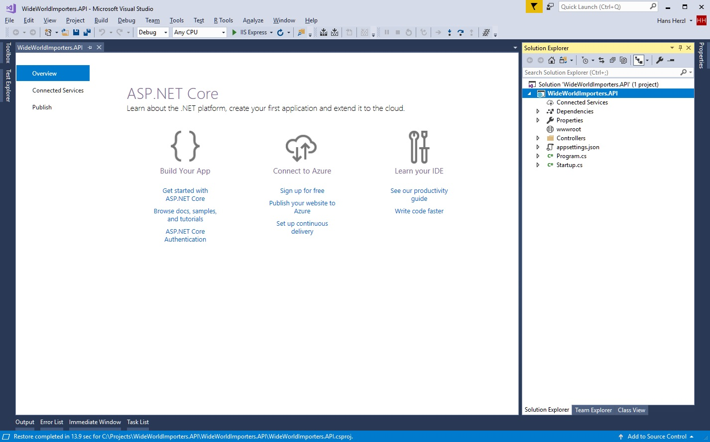

### Step 02 - Install Nuget Packages

Now, we'll proceed to install EntityFrameworkCore.SqlServer package from Nuget, right click on WideWorldImporters.API project:

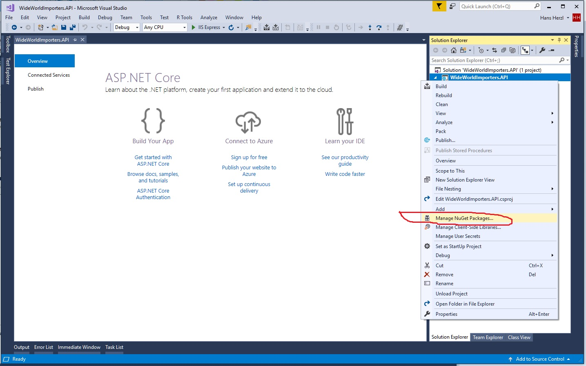

Change to Browse tab and type Microsoft.EntityFrameworkCore.SqlServer:

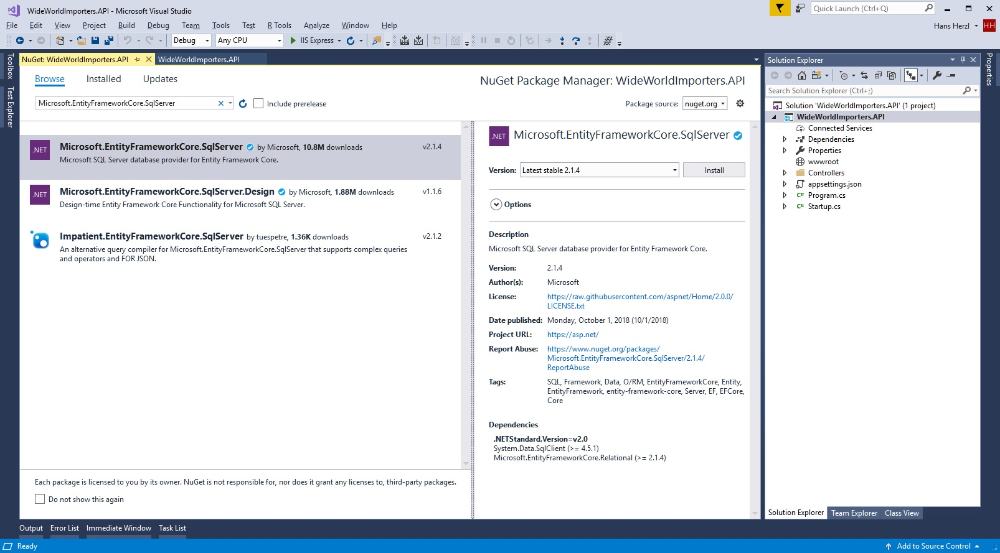

This is the structure for project.

Now run the project to check if solution is ready, press F5 and Visual Studio will show this browser window:

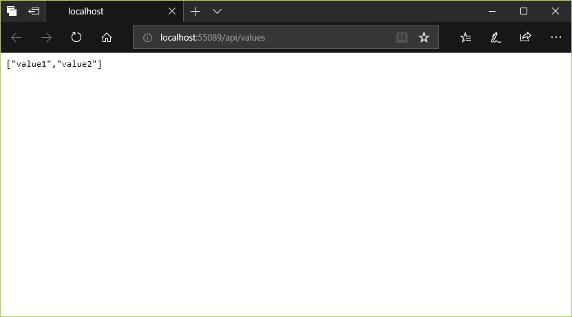

By default, Visual Studio adds a file with name ValuesController in Controllers directory, remove it from project.

### Step 03 - Add Models

Now, create a directory with name Models and add the following files:

    Entities.cs
    Repositories.cs
    Requests.cs
    Responses.cs

Entities.cs will contains all code related to Entity Framework Core.

Repositories.cs will contain the implementation for repositories.

Requests.cs will contain definitions for request models.

Responses.cs will contain definitions for response models.

Code for Entities.cs file:

```csharp
using System;
using Microsoft.EntityFrameworkCore;
using Microsoft.EntityFrameworkCore.Metadata.Builders;

namespace WideWorldImporters.API.Models
{
    public partial class StockItem
    {
        public StockItem()
        {
        }

        public StockItem(int? stockItemID)
        {
            StockItemID = stockItemID;
        }

        public int? StockItemID { get; set; }

        public string StockItemName { get; set; }

        public int? SupplierID { get; set; }

        public int? ColorID { get; set; }

        public int? UnitPackageID { get; set; }

        public int? OuterPackageID { get; set; }

        public string Brand { get; set; }

        public string Size { get; set; }

        public int? LeadTimeDays { get; set; }

        public int? QuantityPerOuter { get; set; }

        public bool? IsChillerStock { get; set; }

        public string Barcode { get; set; }

        public decimal? TaxRate { get; set; }

        public decimal? UnitPrice { get; set; }

        public decimal? RecommendedRetailPrice { get; set; }

        public decimal? TypicalWeightPerUnit { get; set; }

        public string MarketingComments { get; set; }

        public string InternalComments { get; set; }

        public string CustomFields { get; set; }

        public string Tags { get; set; }

        public string SearchDetails { get; set; }

        public int? LastEditedBy { get; set; }

        public DateTime? ValidFrom { get; set; }

        public DateTime? ValidTo { get; set; }
    }

    public class StockItemsConfiguration : IEntityTypeConfiguration<StockItem>
    {
        public void Configure(EntityTypeBuilder<StockItem> builder)
        {
            // Set configuration for entity
            builder.ToTable("StockItems", "Warehouse");

            // Set key for entity
            builder.HasKey(p => p.StockItemID);

            // Set configuration for columns
            builder
                .Property(p => p.StockItemID)
                .HasColumnType("int")
                .IsRequired()
                .HasComputedColumnSql("NEXT VALUE FOR [Sequences].[StockItemID]");

            builder.Property(p => p.StockItemName).HasColumnType("nvarchar(200)").IsRequired();
            builder.Property(p => p.SupplierID).HasColumnType("int").IsRequired();
            builder.Property(p => p.ColorID).HasColumnType("int");
            builder.Property(p => p.UnitPackageID).HasColumnType("int").IsRequired();
            builder.Property(p => p.OuterPackageID).HasColumnType("int").IsRequired();
            builder.Property(p => p.Brand).HasColumnType("nvarchar(100)");
            builder.Property(p => p.Size).HasColumnType("nvarchar(40)");
            builder.Property(p => p.LeadTimeDays).HasColumnType("int").IsRequired();
            builder.Property(p => p.QuantityPerOuter).HasColumnType("int").IsRequired();
            builder.Property(p => p.IsChillerStock).HasColumnType("bit").IsRequired();
            builder.Property(p => p.Barcode).HasColumnType("nvarchar(100)");
            builder.Property(p => p.TaxRate).HasColumnType("decimal(18, 3)").IsRequired();
            builder.Property(p => p.UnitPrice).HasColumnType("decimal(18, 2)").IsRequired();
            builder.Property(p => p.RecommendedRetailPrice).HasColumnType("decimal(18, 2)");
            builder.Property(p => p.TypicalWeightPerUnit).HasColumnType("decimal(18, 3)").IsRequired();
            builder.Property(p => p.MarketingComments).HasColumnType("nvarchar(max)");
            builder.Property(p => p.InternalComments).HasColumnType("nvarchar(max)");
            builder.Property(p => p.CustomFields).HasColumnType("nvarchar(max)");

            builder
                .Property(p => p.Tags)
                .HasColumnType("nvarchar(max)")
                .HasComputedColumnSql("json_query([CustomFields],N'$.Tags')");

            builder
                .Property(p => p.SearchDetails)
                .HasColumnType("nvarchar(max)")
                .IsRequired()
                .HasComputedColumnSql("concat([StockItemName],N' ',[MarketingComments])");

            builder.Property(p => p.LastEditedBy).HasColumnType("int").IsRequired();

            builder
                .Property(p => p.ValidFrom)
                .HasColumnType("datetime2")
                .IsRequired()
                .ValueGeneratedOnAddOrUpdate();

            builder
                .Property(p => p.ValidTo)
                .HasColumnType("datetime2")
                .IsRequired()
                .ValueGeneratedOnAddOrUpdate();
        }
    }

    public class WideWorldImportersDbContext : DbContext
    {
        public WideWorldImportersDbContext(DbContextOptions<WideWorldImportersDbContext> options)
            : base(options)
        {
        }

        protected override void OnModelCreating(ModelBuilder modelBuilder)
        {
            // Apply configurations for entity
            modelBuilder
                .ApplyConfiguration(new StockItemsConfiguration());

            base.OnModelCreating(modelBuilder);
        }

        public DbSet<StockItem> StockItems { get; set; }
    }
}
```

Code for Repositories.cs file:

```csharp
using System;
using System.Linq;
using System.Threading.Tasks;
using Microsoft.EntityFrameworkCore;

namespace WideWorldImporters.API.Models
{
    public interface IRepository : IDisposable
    {
        void Add<TEntity>(TEntity entity) where TEntity : class;

        void Update<TEntity>(TEntity entity) where TEntity : class;

        void Remove<TEntity>(TEntity entity) where TEntity : class;

        int CommitChanges();

        Task<int> CommitChangesAsync();
    }

    public interface IWarehouseRepository : IRepository
    {
        IQueryable<StockItem> GetStockItems(int pageSize = 10, int pageNumber = 1, int? lastEditedBy = null, int? colorID = null, int? outerPackageID = null, int? supplierID = null, int? unitPackageID = null);

        Task<StockItem> GetStockItemsAsync(StockItem entity);

        Task<StockItem> GetStockItemsByStockItemNameAsync(StockItem entity);
    }

    public class Repository
    {
        protected bool Disposed;
        protected WideWorldImportersDbContext DbContext;

        public Repository(WideWorldImportersDbContext dbContext)
        {
            DbContext = dbContext;
        }

        public void Dispose()
        {
            if (!Disposed)
            {
                DbContext?.Dispose();

                Disposed = true;
            }
        }

        public virtual void Add<TEntity>(TEntity entity) where TEntity : class
        {
            // todo: Add code related to addition of entity before to commit changes in database

            DbContext.Add(entity);
        }

        public virtual void Update<TEntity>(TEntity entity) where TEntity : class
        {
            // todo: Add code related to update entity before to commit changes in database

            DbContext.Update(entity);
        }

        public virtual void Remove<TEntity>(TEntity entity) where TEntity : class
        {
            // todo: Add code related to remove entity before to commit changes in database

            DbContext.Remove(entity);
        }

        public int CommitChanges()
            => DbContext.SaveChanges();

        public Task<int> CommitChangesAsync()
            => DbContext.SaveChangesAsync();
    }

    public class WarehouseRepository : Repository, IWarehouseRepository
    {
        public WarehouseRepository(WideWorldImportersDbContext dbContext)
            : base(dbContext)
        {
        }

        public IQueryable<StockItem> GetStockItems(int pageSize = 10, int pageNumber = 1, int? lastEditedBy = null, int? colorID = null, int? outerPackageID = null, int? supplierID = null, int? unitPackageID = null)
        {
            // Get query from DbSet
            var query = DbContext.StockItems.AsQueryable();

            // Filter by: 'LastEditedBy'
            if (lastEditedBy.HasValue)
                query = query.Where(item => item.LastEditedBy == lastEditedBy);

            // Filter by: 'ColorID'
            if (colorID.HasValue)
                query = query.Where(item => item.ColorID == colorID);

            // Filter by: 'OuterPackageID'
            if (outerPackageID.HasValue)
                query = query.Where(item => item.OuterPackageID == outerPackageID);

            // Filter by: 'SupplierID'
            if (supplierID.HasValue)
                query = query.Where(item => item.SupplierID == supplierID);

            // Filter by: 'UnitPackageID'
            if (unitPackageID.HasValue)
                query = query.Where(item => item.UnitPackageID == unitPackageID);

            return query;
        }

        public async Task<StockItem> GetStockItemsAsync(StockItem entity)
            => await DbContext.StockItems.FirstOrDefaultAsync(item => item.StockItemID == entity.StockItemID);

        public async Task<StockItem> GetStockItemsByStockItemNameAsync(StockItem entity)
            => await DbContext.StockItems.FirstOrDefaultAsync(item => item.StockItemName == entity.StockItemName);
    }

    public static class RepositoryExtensions
    {
        public static IQueryable<TEntity> Paging<TEntity>(this WideWorldImportersDbContext dbContext, int pageSize = 0, int pageNumber = 0) where TEntity : class
        {
            var query = dbContext.Set<TEntity>().AsQueryable();

            return pageSize > 0 && pageNumber > 0 ? query.Skip((pageNumber - 1) * pageSize).Take(pageSize) : query;
        }

        public static IQueryable<TModel> Paging<TModel>(this IQueryable<TModel> query, int pageSize = 0, int pageNumber = 0) where TModel : class
            => pageSize > 0 && pageNumber > 0 ? query.Skip((pageNumber - 1) * pageSize).Take(pageSize) : query;
    }
}
```

Code for Requests.cs file:

```csharp
using System;
using System.ComponentModel.DataAnnotations;

namespace WideWorldImporters.API.Models
{
    public class PostStockItemsRequestModel
    {
        [Key]
        public int? StockItemID { get; set; }

        [Required]
        [StringLength(200)]
        public string StockItemName { get; set; }

        [Required]
        public int? SupplierID { get; set; }

        public int? ColorID { get; set; }

        [Required]
        public int? UnitPackageID { get; set; }

        [Required]
        public int? OuterPackageID { get; set; }

        [StringLength(100)]
        public string Brand { get; set; }

        [StringLength(40)]
        public string Size { get; set; }

        [Required]
        public int? LeadTimeDays { get; set; }

        [Required]
        public int? QuantityPerOuter { get; set; }

        [Required]
        public bool? IsChillerStock { get; set; }

        [StringLength(100)]
        public string Barcode { get; set; }

        [Required]
        public decimal? TaxRate { get; set; }

        [Required]
        public decimal? UnitPrice { get; set; }

        public decimal? RecommendedRetailPrice { get; set; }

        [Required]
        public decimal? TypicalWeightPerUnit { get; set; }

        public string MarketingComments { get; set; }

        public string InternalComments { get; set; }

        public string CustomFields { get; set; }

        public string Tags { get; set; }

        [Required]
        public string SearchDetails { get; set; }

        [Required]
        public int? LastEditedBy { get; set; }

        public DateTime? ValidFrom { get; set; }

        public DateTime? ValidTo { get; set; }
    }

    public class PutStockItemsRequestModel
    {
        [Required]
        [StringLength(200)]
        public string StockItemName { get; set; }

        [Required]
        public int? SupplierID { get; set; }

        public int? ColorID { get; set; }

        [Required]
        public decimal? UnitPrice { get; set; }
    }

    public static class Extensions
    {
        public static StockItem ToEntity(this PostStockItemsRequestModel requestModel)
            => new StockItem
            {
                StockItemID = requestModel.StockItemID,
                StockItemName = requestModel.StockItemName,
                SupplierID = requestModel.SupplierID,
                ColorID = requestModel.ColorID,
                UnitPackageID = requestModel.UnitPackageID,
                OuterPackageID = requestModel.OuterPackageID,
                Brand = requestModel.Brand,
                Size = requestModel.Size,
                LeadTimeDays = requestModel.LeadTimeDays,
                QuantityPerOuter = requestModel.QuantityPerOuter,
                IsChillerStock = requestModel.IsChillerStock,
                Barcode = requestModel.Barcode,
                TaxRate = requestModel.TaxRate,
                UnitPrice = requestModel.UnitPrice,
                RecommendedRetailPrice = requestModel.RecommendedRetailPrice,
                TypicalWeightPerUnit = requestModel.TypicalWeightPerUnit,
                MarketingComments = requestModel.MarketingComments,
                InternalComments = requestModel.InternalComments,
                CustomFields = requestModel.CustomFields,
                Tags = requestModel.Tags,
                SearchDetails = requestModel.SearchDetails,
                LastEditedBy = requestModel.LastEditedBy,
                ValidFrom = requestModel.ValidFrom,
                ValidTo = requestModel.ValidTo
            };
    }
}
```

Code for Responses.cs file:

```csharp
using System.Collections.Generic;
using System.Net;
using Microsoft.AspNetCore.Mvc;

namespace WideWorldImporters.API.Models
{
    public interface IResponse
    {
        string Message { get; set; }

        bool DidError { get; set; }

        string ErrorMessage { get; set; }
    }

    public interface ISingleResponse<TModel> : IResponse
    {
        TModel Model { get; set; }
    }

    public interface IListResponse<TModel> : IResponse
    {
        IEnumerable<TModel> Model { get; set; }
    }

    public interface IPagedResponse<TModel> : IListResponse<TModel>
    {
        int ItemsCount { get; set; }

        int PageCount { get; }
    }

    public class SingleResponse<TModel> : ISingleResponse<TModel>
    {
        public string Message { get; set; }

        public bool DidError { get; set; }

        public string ErrorMessage { get; set; }

        public TModel Model { get; set; }
    }

    public class ListResponse<TModel> : IListResponse<TModel>
    {
        public string Message { get; set; }

        public bool DidError { get; set; }

        public string ErrorMessage { get; set; }

        public IEnumerable<TModel> Model { get; set; }
    }

    public class PagedResponse<TModel> : IPagedResponse<TModel>
    {
        public string Message { get; set; }

        public bool DidError { get; set; }

        public string ErrorMessage { get; set; }

        public IEnumerable<TModel> Model { get; set; }

        public int PageSize { get; set; }

        public int PageNumber { get; set; }

        public int ItemsCount { get; set; }

        public int PageCount =>
            PageSize == 0 ? 0 : ItemsCount / PageSize;
    }

    public static class ResponseExtensions
    {
        public static IActionResult ToHttpResponse<TModel>(this IListResponse<TModel> response)
        {
            var status = HttpStatusCode.OK;

            if (response.DidError)
                status = HttpStatusCode.InternalServerError;
            else if (response.Model == null)
                status = HttpStatusCode.NoContent;

            return new ObjectResult(response)
            {
                StatusCode = (int)status
            };
        }

        public static IActionResult ToHttpResponse<TModel>(this ISingleResponse<TModel> response)
        {
            var status = HttpStatusCode.OK;

            if (response.DidError)
                status = HttpStatusCode.InternalServerError;
            else if (response.Model == null)
                status = HttpStatusCode.NotFound;

            return new ObjectResult(response)
            {
                StatusCode = (int)status
            };
        }
    }
}
```

Understanding Models

ENTITIES

StockItems class is the representation for Warehouse.StockItems table.

StockItemsConfiguration class contains the mapping for StockItems class.

WideWorldImportersDbContext class is the link between database and C# code, this class handles queries and commits the changes in database and of course, another things.

REPOSITORIES

IRepository interface represents the model for features.

IWarehouseRepository interface contains all operations related for Warehouse feature, in this guide, we're working only with Warehouse.StockItems table.

Repository class is the abstract model for repositories.

WarehouseRepository contains all implementations for Warehouse feature.

RepositoryExtensions contains extension methods to allow paging in repositories.

REQUESTS

We have the following definitions:

    PostStockItemsRequestModel
    PutStockItemsRequestModel

PostStockItemsRequestModel represents the model to create a new stock item, contains all required properties to save in database.

PutStockItemsRequestModel represents the model to update an existing stock item, in this case contains only 4 properties: StockItemName, SupplierID, ColorID and UnitPrice. This class doesn't contain StockItemID property because id is in route for controller's action.

The models for requests do not require to contain all properties like entities, because we don't need to expose full definition in a request or response, it's a good practice to limit data using models with few properties.

Extensions class contains an extension method for PostStockItemsRequestModel, to return an instance of StockItem class from request model.

RESPONSES

These are the interfaces:

    IResponse
    ISingleResponse<TModel>
    IListResponse<TModel>
    IPagedResponse<TModel>

Each one of these interfaces has implementations, why do we need these definitions if it's more simple to return objects without wrapping them in these models? Keep in mind this Web API will provide operations for clients, with UI or without UI and it's more easy to have properties to send message, to have a model or send information if an error occurs, in addition, we set Http status code in response to describe the result from request.

These classes are generic, because in this way, we save time to define responses in future, this Web API only returns a response for a single entity, a list and a paged list.

ISingleResponse represents a response for a single entity.

IListResponse represents a response with a list, for example all shipping to existing order without paging.

IPagedResponse represents a response with pagination, for example all orders in a date range.

ResponseExtensions class contains extension methods to convert a response in a Http response, these methods return InternalServerError (500) status if an error occurs, OK (200) if it's OK and NotFound (404) if an entity does not exist in database or NoContent (204) for list responses without model.

### Step 04 - Add Controller

Now, inside of Controllers directory, add a code file with name WarehouseController.cs and add this code:

```csharp
using System;
using System.Threading.Tasks;
using Microsoft.AspNetCore.Mvc;
using Microsoft.EntityFrameworkCore;
using Microsoft.Extensions.Logging;
using WideWorldImporters.API.Models;

namespace WideWorldImporters.API.Controllers
{
    [ApiController]
    [Route("api/v1/[controller]")]
    public class WarehouseController : ControllerBase
    {
        protected readonly ILogger Logger;
        protected readonly IWarehouseRepository Repository;

        public WarehouseController(ILogger<WarehouseController> logger, IWarehouseRepository repository)
        {
            Logger = logger;
            Repository = repository;
        }

        // GET
        // api/v1/StockItem

        [HttpGet("StockItem")]
        public async Task<IActionResult> GetStockItemsAsync(int pageSize = 10, int pageNumber = 1, int? lastEditedBy = null, int? colorID = null, int? outerPackageID = null, int? supplierID = null, int? unitPackageID = null)
        {
            Logger?.LogDebug("'{0}' has been invoked", nameof(GetStockItemsAsync));

            var response = new PagedResponse<StockItem>();

            try
            {
                // Get the "proposed" query from repository
                var query = Repository.GetStockItems();

                // Set paging values
                response.PageSize = pageSize;
                response.PageNumber = pageNumber;

                // Get the total rows
                response.ItemsCount = await query.CountAsync();

                // Get the specific page from database
                response.Model = await query.Paging(pageSize, pageNumber).ToListAsync();

                Logger?.LogInformation("The stock items have been retrieved successfully.");
            }
            catch (Exception ex)
            {
                response.DidError = true;
                response.ErrorMessage = "There was an internal error, please contact to technical support.";

                Logger?.LogCritical("There was an error on '{0}' invocation: {1}", nameof(GetStockItemsAsync), ex);
            }

            return response.ToHttpResponse();
        }

        // GET
        // api/v1/StockItem/5

        [HttpGet("StockItem/{id}")]
        public async Task<IActionResult> GetStockItemAsync(int id)
        {
            Logger?.LogDebug("'{0}' has been invoked", nameof(GetStockItemAsync));

            var response = new SingleResponse<StockItem>();

            try
            {
                // Get the stock item by id
                response.Model = await Repository.GetStockItemsAsync(new StockItem(id));
            }
            catch (Exception ex)
            {
                response.DidError = true;
                response.ErrorMessage = "There was an internal error, please contact to technical support.";

                Logger?.LogCritical("There was an error on '{0}' invocation: {1}", nameof(GetStockItemAsync), ex);
            }

            return response.ToHttpResponse();
        }

        // POST
        // api/v1/StockItem/

        [HttpPost("StockItem")]
        public async Task<IActionResult> PostStockItemAsync([FromBody]PostStockItemsRequestModel requestModel)
        {
            Logger?.LogDebug("'{0}' has been invoked", nameof(PostStockItemAsync));

            var response = new SingleResponse<StockItem>();

            try
            {
                var existingEntity = await Repository
                    .GetStockItemsByStockItemNameAsync(new StockItem { StockItemName = requestModel.StockItemName });

                if (existingEntity != null)
                    ModelState.AddModelError("StockItemName", "Stock item name already exists");

                if (!ModelState.IsValid)
                    return BadRequest();

                // Create entity from request model
                var entity = requestModel.ToEntity();

                // Add entity to repository
                Repository.Add(entity);

                // Save entity in database
                await Repository.CommitChangesAsync();

                // Set the entity to response model
                response.Model = entity;
            }
            catch (Exception ex)
            {
                response.DidError = true;
                response.ErrorMessage = "There was an internal error, please contact to technical support.";

                Logger?.LogCritical("There was an error on '{0}' invocation: {1}", nameof(PostStockItemAsync), ex);
            }

            return response.ToHttpResponse();
        }

        // PUT
        // api/v1/StockItem/5

        [HttpPut("StockItem/{id}")]
        public async Task<IActionResult> PutStockItemAsync(int id, [FromBody]PutStockItemsRequestModel requestModel)
        {
            Logger?.LogDebug("'{0}' has been invoked", nameof(PutStockItemAsync));

            var response = new SingleResponse<StockItem>();

            try
            {
                // Get stock item by id
                var entity = await Repository.GetStockItemsAsync(new StockItem(id));

                // Validate if entity exists
                if (entity == null)
                    return response.ToHttpResponse();

                // Set changes to entity
                entity.StockItemName = requestModel.StockItemName;
                entity.SupplierID = requestModel.SupplierID;
                entity.ColorID = requestModel.ColorID;
                entity.UnitPrice = requestModel.UnitPrice;

                // Update entity in repository
                Repository.Update(entity);

                // Save entity in database
                await Repository.CommitChangesAsync();

                // Set the entity to response model
                response.Model = entity;
            }
            catch (Exception ex)
            {
                response.DidError = true;
                response.ErrorMessage = "There was an internal error, please contact to technical support.";

                Logger?.LogCritical("There was an error on '{0}' invocation: {1}", nameof(PutStockItemAsync), ex);
            }

            return response.ToHttpResponse();
        }

        // DELETE
        // api/v1/StockItem/5

        [HttpDelete("StockItem/{id}")]
        public async Task<IActionResult> DeleteStockItemAsync(int id)
        {
            Logger?.LogDebug("'{0}' has been invoked", nameof(DeleteStockItemAsync));

            var response = new SingleResponse<StockItem>();

            try
            {
                // Get stock item by id
                var entity = await Repository.GetStockItemsAsync(new StockItem(id));

                // Validate if entity exists
                if (entity == null)
                    return response.ToHttpResponse();

                // Remove entity from repository
                Repository.Remove(entity);

                // Delete entity in database
                await Repository.CommitChangesAsync();

                // Set the entity to response model
                response.Model = entity;
            }
            catch (Exception ex)
            {
                response.DidError = true;
                response.ErrorMessage = "There was an internal error, please contact to technical support.";

                Logger?.LogCritical("There was an error on '{0}' invocation: {1}", nameof(DeleteStockItemAsync), ex);
            }

            return response.ToHttpResponse();
        }
    }
}

```

The process for all controller's actions is:

    Log the invocation for method.
    Create the instance for response according to action (Paged, list or single).
    Perform access to database through repository instance.
    If invocation for repository fails, set DidError property as true and set ErrorMessage property with: There was an internal error, please contact to technical support., because it isn't recommended to expose error details in response, it's better to save all exception details in log file.
    Return result as Http response.

Keep in mind all names for methods that end with Async sufix because all operations are async but in Http attributes, we don't use this suffix.

### Step 05 - Setting Up Dependency Injection

ASP.NET Core enables dependency injection in native way, this means we don't need any 3rd party framework to inject dependencies in controllers.

This is a great challenge because we need to change our mind from Web Forms and ASP.NET MVC, for those technologies use a framework to inject dependencies it was a luxury, now in ASP.NET Core dependency injection is a basic aspect.

Project template for ASP.NET Core has a class with name Startup, in this class we must to add the configuration to inject instances for DbContext, Repositories, Loggers, etc.

Modify the code of Startup.cs file to look like this:

```csharp
using Microsoft.AspNetCore.Builder;
using Microsoft.AspNetCore.Hosting;
using Microsoft.AspNetCore.Mvc;
using Microsoft.EntityFrameworkCore;
using Microsoft.Extensions.Configuration;
using Microsoft.Extensions.DependencyInjection;
using Microsoft.Extensions.Logging;
using WideWorldImporters.API.Controllers;
using WideWorldImporters.API.Models;

namespace WideWorldImporters.API
{
    public class Startup
    {
        public Startup(IConfiguration configuration)
        {
            Configuration = configuration;
        }

        public IConfiguration Configuration { get; }

        // This method gets called by the runtime. Use this method to add services to the container.
        public void ConfigureServices(IServiceCollection services)
        {
            services.AddMvc().SetCompatibilityVersion(CompatibilityVersion.Version_2_1);

            // Add configuration for DbContext
            // Use connection string from appsettings.json file
            services.AddDbContext<WideWorldImportersDbContext>(options =>
            {
                options.UseSqlServer(Configuration["AppSettings:ConnectionString"]);
            });

            // Set up dependency injection for controller's logger
            services.AddScoped<ILogger, Logger<WarehouseController>>();

            // Set up dependency injection for repository
            services.AddScoped<IWarehouseRepository, WarehouseRepository>();
        }

        // This method gets called by the runtime. Use this method to configure the HTTP request pipeline.
        public void Configure(IApplicationBuilder app, IHostingEnvironment env)
        {
            if (env.IsDevelopment())
                app.UseDeveloperExceptionPage();

            app.UseMvc();
        }
    }
}
```

The ConfigureServices method specifies how dependencies will be resolved, in this method. We need to set up DbContext, Repositories and Logging.

The Configure method adds the configuration for Http request runtime.

### Step 06 - Running Web API

Before you run Web API project, add the connection string in appsettings.json file:

```javascript
{
  "Logging": {
    "LogLevel": {
      "Default": "Warning"
    }
  },
  "AllowedHosts": "*",
  "AppSettings": {
    "ConnectionString": "server=(local);database=WideWorldImporters;integrated security=yes;"
  }
}
```

Now, press F5 to start debugging for Web API project, if everything it's OK, we'll get the following output in the browser:

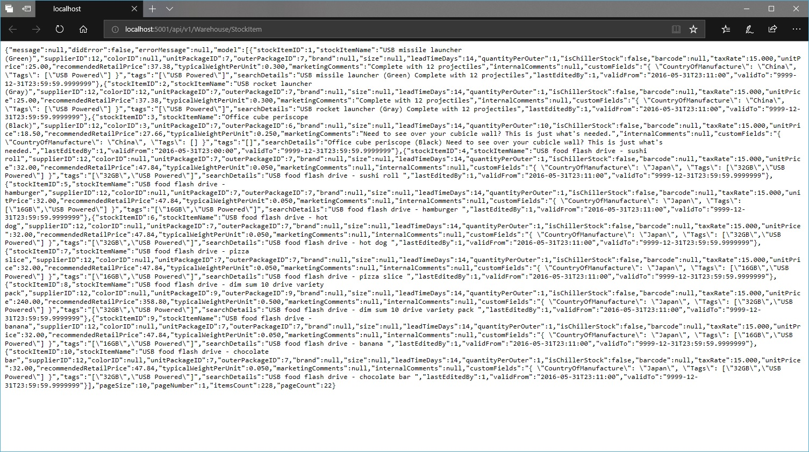

### Step 07 - Add Unit Tests

In order to add unit tests for API project, follow these steps:

    Right click on Solution > Add > New Project
    Go to Installed > Visual C# > Test > xUnit Test Project (.NET Core)
    Set the name for project as WideWorldImporters.API.UnitTests
    Click OK


Manage references for WideWorldImporters.API.UnitTests project:

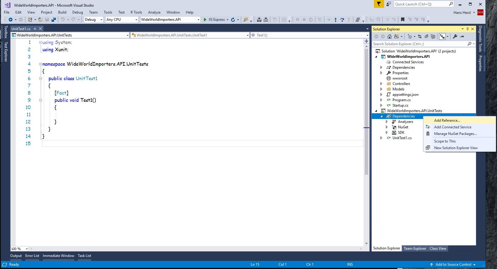

Now add a reference for WideWorldImporters.API project:

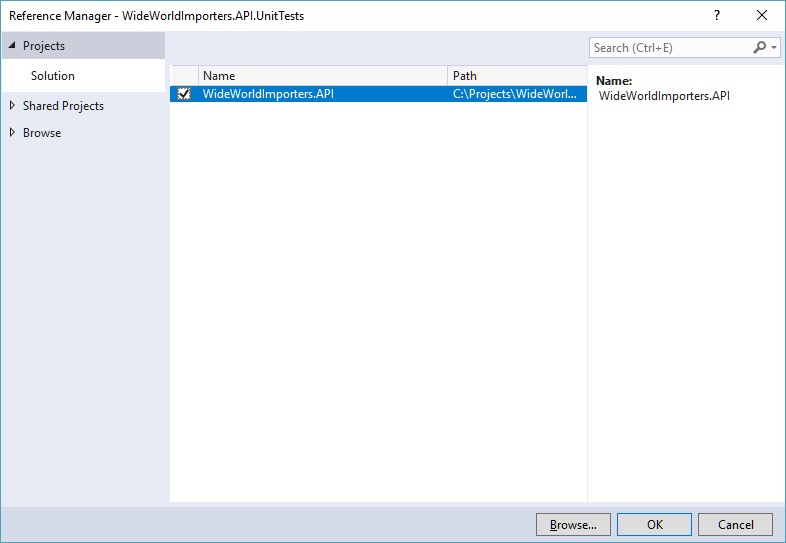

Once we have created the project, add the following NuGet packages for project:

    Microsoft.AspNetCore.Mvc.Core
    Microsoft.EntityFrameworkCore.InMemory

Remove UnitTest1.cs file.

Save changes and build WideWorldImporters.API.UnitTests project.

Now we proceed to add code related for unit tests, these tests will work with In memory database.

What is TDD? Testing is a common practice in nowadays, because with unit tests, it's easy to performing tests for features before to publish, Test Driven Development (TDD) is the way to define unit tests and validate the behavior in code.

Another concept in TDD is AAA: Arrange, Act and Assert; Arrange is the block for creation of objects, Act is the block to place all invocations for methods and Assert is the block to validate the results from methods invocation.

Since we're working with In memory database for unit tests, we need to create a class to mock WideWorldImportersDbContext class and also add data to perform testing for IWarehouseRepository operations.

To be clear: these unit tests do not establish a connection with SQL Server.

For unit tests, add the following files:

    DbContextExtensions.cs
    RepositoryMocker.cs
    WarehouseControllerUnitTest.cs

Code for RepositoryMocker.cs file:

```csharp
using Microsoft.EntityFrameworkCore;
using WideWorldImporters.API.Models;

namespace WideWorldImporters.API.UnitTests
{
    public static class RepositoryMocker
    {
        public static IWarehouseRepository GetWarehouseRepository(string dbName)
        {
            // Create options for DbContext instance
            var options = new DbContextOptionsBuilder<WideWorldImportersDbContext>()
                .UseInMemoryDatabase(databaseName: dbName)
                .Options;

            // Create instance of DbContext
            var dbContext = new WideWorldImportersDbContext(options);

            // Add entities in memory
            dbContext.Seed();

            return new WarehouseRepository(dbContext);
        }
    }
}
```

Code for DbContextExtensions.cs file:

```csharp
using System;
using WideWorldImporters.API.Models;

namespace WideWorldImporters.API.UnitTests
{
    public static class DbContextExtensions
    {
        public static void Seed(this WideWorldImportersDbContext dbContext)
        {
            // Add entities for DbContext instance

            dbContext.StockItems.Add(new StockItem
            {
                StockItemID = 1,
                StockItemName = "USB missile launcher (Green)",
                SupplierID = 12,
                UnitPackageID = 7,
                OuterPackageID = 7,
                LeadTimeDays = 14,
                QuantityPerOuter = 1,
                IsChillerStock = false,
                TaxRate = 15.000m,
                UnitPrice = 25.00m,
                RecommendedRetailPrice = 37.38m,
                TypicalWeightPerUnit = 0.300m,
                MarketingComments = "Complete with 12 projectiles",
                CustomFields = "{ \"CountryOfManufacture\": \"China\", \"Tags\": [\"USB Powered\"] }",
                Tags = "[\"USB Powered\"]",
                SearchDetails = "USB missile launcher (Green) Complete with 12 projectiles",
                LastEditedBy = 1,
                ValidFrom = Convert.ToDateTime("5/31/2016 11:11:00 PM"),
                ValidTo = Convert.ToDateTime("12/31/9999 11:59:59 PM")
            });

            dbContext.StockItems.Add(new StockItem
            {
                StockItemID = 2,
                StockItemName = "USB rocket launcher (Gray)",
                SupplierID = 12,
                ColorID = 12,
                UnitPackageID = 7,
                OuterPackageID = 7,
                LeadTimeDays = 14,
                QuantityPerOuter = 1,
                IsChillerStock = false,
                TaxRate = 15.000m,
                UnitPrice = 25.00m,
                RecommendedRetailPrice = 37.38m,
                TypicalWeightPerUnit = 0.300m,
                MarketingComments = "Complete with 12 projectiles",
                CustomFields = "{ \"CountryOfManufacture\": \"China\", \"Tags\": [\"USB Powered\"] }",
                Tags = "[\"USB Powered\"]",
                SearchDetails = "USB rocket launcher (Gray) Complete with 12 projectiles",
                LastEditedBy = 1,
                ValidFrom = Convert.ToDateTime("5/31/2016 11:11:00 PM"),
                ValidTo = Convert.ToDateTime("12/31/9999 11:59:59 PM")
            });

            dbContext.StockItems.Add(new StockItem
            {
                StockItemID = 3,
                StockItemName = "Office cube periscope (Black)",
                SupplierID = 12,
                ColorID = 3,
                UnitPackageID = 7,
                OuterPackageID = 6,
                LeadTimeDays = 14,
                QuantityPerOuter = 10,
                IsChillerStock = false,
                TaxRate = 15.000m,
                UnitPrice = 18.50m,
                RecommendedRetailPrice = 27.66m,
                TypicalWeightPerUnit = 0.250m,
                MarketingComments = "Need to see over your cubicle wall? This is just what's needed.",
                CustomFields = "{ \"CountryOfManufacture\": \"China\", \"Tags\": [] }",
                Tags = "[]",
                SearchDetails = "Office cube periscope (Black) Need to see over your cubicle wall? This is just what's needed.",
                LastEditedBy = 1,
                ValidFrom = Convert.ToDateTime("5/31/2016 11:00:00 PM"),
                ValidTo = Convert.ToDateTime("12/31/9999 11:59:59 PM")
            });

            dbContext.StockItems.Add(new StockItem
            {
                StockItemID = 4,
                StockItemName = "USB food flash drive - sushi roll",
                SupplierID = 12,
                UnitPackageID = 7,
                OuterPackageID = 7,
                LeadTimeDays = 14,
                QuantityPerOuter = 1,
                IsChillerStock = false,
                TaxRate = 15.000m,
                UnitPrice = 32.00m,
                RecommendedRetailPrice = 47.84m,
                TypicalWeightPerUnit = 0.050m,
                CustomFields = "{ \"CountryOfManufacture\": \"Japan\", \"Tags\": [\"32GB\",\"USB Powered\"] }",
                Tags = "[\"32GB\",\"USB Powered\"]",
                SearchDetails = "USB food flash drive - sushi roll ",
                LastEditedBy = 1,
                ValidFrom = Convert.ToDateTime("5/31/2016 11:11:00 PM"),
                ValidTo = Convert.ToDateTime("12/31/9999 11:59:59 PM")
            });

            dbContext.StockItems.Add(new StockItem
            {
                StockItemID = 5,
                StockItemName = "USB food flash drive - hamburger",
                SupplierID = 12,
                UnitPackageID = 7,
                OuterPackageID = 7,
                LeadTimeDays = 14,
                QuantityPerOuter = 1,
                IsChillerStock = false,
                TaxRate = 15.000m,
                UnitPrice = 32.00m,
                RecommendedRetailPrice = 47.84m,
                TypicalWeightPerUnit = 0.050m,
                CustomFields = "{ \"CountryOfManufacture\": \"Japan\", \"Tags\": [\"16GB\",\"USB Powered\"] }",
                Tags = "[\"16GB\",\"USB Powered\"]",
                SearchDetails = "USB food flash drive - hamburger ",
                LastEditedBy = 1,
                ValidFrom = Convert.ToDateTime("5/31/2016 11:11:00 PM"),
                ValidTo = Convert.ToDateTime("12/31/9999 11:59:59 PM")
            });

            dbContext.StockItems.Add(new StockItem
            {
                StockItemID = 6,
                StockItemName = "USB food flash drive - hot dog",
                SupplierID = 12,
                UnitPackageID = 7,
                OuterPackageID = 7,
                LeadTimeDays = 14,
                QuantityPerOuter = 1,
                IsChillerStock = false,
                TaxRate = 15.000m,
                UnitPrice = 32.00m,
                RecommendedRetailPrice = 47.84m,
                TypicalWeightPerUnit = 0.050m,
                CustomFields = "{ \"CountryOfManufacture\": \"Japan\", \"Tags\": [\"32GB\",\"USB Powered\"] }",
                Tags = "[\"32GB\",\"USB Powered\"]",
                SearchDetails = "USB food flash drive - hot dog ",
                LastEditedBy = 1,
                ValidFrom = Convert.ToDateTime("5/31/2016 11:11:00 PM"),
                ValidTo = Convert.ToDateTime("12/31/9999 11:59:59 PM")
            });

            dbContext.StockItems.Add(new StockItem
            {
                StockItemID = 7,
                StockItemName = "USB food flash drive - pizza slice",
                SupplierID = 12,
                UnitPackageID = 7,
                OuterPackageID = 7,
                LeadTimeDays = 14,
                QuantityPerOuter = 1,
                IsChillerStock = false,
                TaxRate = 15.000m,
                UnitPrice = 32.00m,
                RecommendedRetailPrice = 47.84m,
                TypicalWeightPerUnit = 0.050m,
                CustomFields = "{ \"CountryOfManufacture\": \"Japan\", \"Tags\": [\"16GB\",\"USB Powered\"] }",
                Tags = "[\"16GB\",\"USB Powered\"]",
                SearchDetails = "USB food flash drive - pizza slice ",
                LastEditedBy = 1,
                ValidFrom = Convert.ToDateTime("5/31/2016 11:11:00 PM"),
                ValidTo = Convert.ToDateTime("12/31/9999 11:59:59 PM")
            });

            dbContext.StockItems.Add(new StockItem
            {
                StockItemID = 8,
                StockItemName = "USB food flash drive - dim sum 10 drive variety pack",
                SupplierID = 12,
                UnitPackageID = 9,
                OuterPackageID = 9,
                LeadTimeDays = 14,
                QuantityPerOuter = 1,
                IsChillerStock = false,
                TaxRate = 15.000m,
                UnitPrice = 240.00m,
                RecommendedRetailPrice = 358.80m,
                TypicalWeightPerUnit = 0.500m,
                CustomFields = "{ \"CountryOfManufacture\": \"Japan\", \"Tags\": [\"32GB\",\"USB Powered\"] }",
                Tags = "[\"32GB\",\"USB Powered\"]",
                SearchDetails = "USB food flash drive - dim sum 10 drive variety pack ",
                LastEditedBy = 1,
                ValidFrom = Convert.ToDateTime("5/31/2016 11:11:00 PM"),
                ValidTo = Convert.ToDateTime("12/31/9999 11:59:59 PM")
            });

            dbContext.StockItems.Add(new StockItem
            {
                StockItemID = 9,
                StockItemName = "USB food flash drive - banana",
                SupplierID = 12,
                UnitPackageID = 7,
                OuterPackageID = 7,
                LeadTimeDays = 14,
                QuantityPerOuter = 1,
                IsChillerStock = false,
                TaxRate = 15.000m,
                UnitPrice = 32.00m,
                RecommendedRetailPrice = 47.84m,
                TypicalWeightPerUnit = 0.050m,
                CustomFields = "{ \"CountryOfManufacture\": \"Japan\", \"Tags\": [\"16GB\",\"USB Powered\"] }",
                Tags = "[\"16GB\",\"USB Powered\"]",
                SearchDetails = "USB food flash drive - banana ",
                LastEditedBy = 1,
                ValidFrom = Convert.ToDateTime("5/31/2016 11:11:00 PM"),
                ValidTo = Convert.ToDateTime("12/31/9999 11:59:59 PM")
            });

            dbContext.StockItems.Add(new StockItem
            {
                StockItemID = 10,
                StockItemName = "USB food flash drive - chocolate bar",
                SupplierID = 12,
                UnitPackageID = 7,
                OuterPackageID = 7,
                LeadTimeDays = 14,
                QuantityPerOuter = 1,
                IsChillerStock = false,
                TaxRate = 15.000m,
                UnitPrice = 32.00m,
                RecommendedRetailPrice = 47.84m,
                TypicalWeightPerUnit = 0.050m,
                CustomFields = "{ \"CountryOfManufacture\": \"Japan\", \"Tags\": [\"32GB\",\"USB Powered\"] }",
                Tags = "[\"32GB\",\"USB Powered\"]",
                SearchDetails = "USB food flash drive - chocolate bar ",
                LastEditedBy = 1,
                ValidFrom = Convert.ToDateTime("5/31/2016 11:11:00 PM"),
                ValidTo = Convert.ToDateTime("12/31/9999 11:59:59 PM")
            });

            dbContext.StockItems.Add(new StockItem
            {
                StockItemID = 11,
                StockItemName = "USB food flash drive - cookie",
                SupplierID = 12,
                UnitPackageID = 7,
                OuterPackageID = 7,
                LeadTimeDays = 14,
                QuantityPerOuter = 1,
                IsChillerStock = false,
                TaxRate = 15.000m,
                UnitPrice = 32.00m,
                RecommendedRetailPrice = 47.84m,
                TypicalWeightPerUnit = 0.050m,
                CustomFields = "{ \"CountryOfManufacture\": \"Japan\", \"Tags\": [\"16GB\",\"USB Powered\"] }",
                Tags = "[\"16GB\",\"USB Powered\"]",
                SearchDetails = "USB food flash drive - cookie ",
                LastEditedBy = 1,
                ValidFrom = Convert.ToDateTime("5/31/2016 11:11:00 PM"),
                ValidTo = Convert.ToDateTime("12/31/9999 11:59:59 PM")
            });

            dbContext.StockItems.Add(new StockItem
            {
                StockItemID = 12,
                StockItemName = "USB food flash drive - donut",
                SupplierID = 12,
                UnitPackageID = 7,
                OuterPackageID = 7,
                LeadTimeDays = 14,
                QuantityPerOuter = 1,
                IsChillerStock = false,
                TaxRate = 15.000m,
                UnitPrice = 32.00m,
                RecommendedRetailPrice = 47.84m,
                TypicalWeightPerUnit = 0.050m,
                CustomFields = "{ \"CountryOfManufacture\": \"Japan\", \"Tags\": [\"32GB\",\"USB Powered\"] }",
                Tags = "[\"32GB\",\"USB Powered\"]",
                SearchDetails = "USB food flash drive - donut ",
                LastEditedBy = 1,
                ValidFrom = Convert.ToDateTime("5/31/2016 11:11:00 PM"),
                ValidTo = Convert.ToDateTime("12/31/9999 11:59:59 PM")
            });

            dbContext.SaveChanges();
        }
    }
}
```

Code for WarehouseControllerUnitTest.cs file:

```csharp
using System;
using System.Threading.Tasks;
using Microsoft.AspNetCore.Mvc;
using WideWorldImporters.API.Controllers;
using WideWorldImporters.API.Models;
using Xunit;

namespace WideWorldImporters.API.UnitTests
{
    public class WarehouseControllerUnitTest
    {
        [Fact]
        public async Task TestGetStockItemsAsync()
        {
            // Arrange
            var repository = RepositoryMocker.GetWarehouseRepository(nameof(TestGetStockItemsAsync));
            var controller = new WarehouseController(null, repository);

            // Act
            var response = await controller.GetStockItemsAsync() as ObjectResult;
            var value = response.Value as IPagedResponse<StockItem>;

            repository.Dispose();

            // Assert
            Assert.False(value.DidError);
        }

        [Fact]
        public async Task TestGetStockItemAsync()
        {
            // Arrange
            var repository = RepositoryMocker.GetWarehouseRepository(nameof(TestGetStockItemAsync));
            var controller = new WarehouseController(null, repository);
            var id = 1;

            // Act
            var response = await controller.GetStockItemAsync(id) as ObjectResult;
            var value = response.Value as ISingleResponse<StockItem>;

            repository.Dispose();

            // Assert
            Assert.False(value.DidError);
        }

        [Fact]
        public async Task TestPostStockItemAsync()
        {
            // Arrange
            var repository = RepositoryMocker.GetWarehouseRepository(nameof(TestPostStockItemAsync));
            var controller = new WarehouseController(null, repository);
            var requestModel = new PostStockItemsRequestModel
            {
                StockItemID = 100,
                StockItemName = "USB anime flash drive - Goku",
                SupplierID = 12,
                UnitPackageID = 7,
                OuterPackageID = 7,
                LeadTimeDays = 14,
                QuantityPerOuter = 1,
                IsChillerStock = false,
                TaxRate = 15.000m,
                UnitPrice = 32.00m,
                RecommendedRetailPrice = 47.84m,
                TypicalWeightPerUnit = 0.050m,
                CustomFields = "{ \"CountryOfManufacture\": \"Japan\", \"Tags\": [\"32GB\",\"USB Powered\"] }",
                Tags = "[\"32GB\",\"USB Powered\"]",
                SearchDetails = "USB anime flash drive - Goku",
                LastEditedBy = 1,
                ValidFrom = DateTime.Now,
                ValidTo = DateTime.Now.AddYears(5)
            };

            // Act
            var response = await controller.PostStockItemAsync(requestModel) as ObjectResult;
            var value = response.Value as ISingleResponse<StockItem>;

            repository.Dispose();

            // Assert
            Assert.False(value.DidError);
        }

        [Fact]
        public async Task TestPutStockItemAsync()
        {
            // Arrange
            var repository = RepositoryMocker.GetWarehouseRepository(nameof(TestPutStockItemAsync));
            var controller = new WarehouseController(null, repository);
            var id = 12;
            var requestModel = new PutStockItemsRequestModel
            {
                StockItemName = "USB food flash drive (Update)",
                SupplierID = 12,
                ColorID = 3
            };

            // Act
            var response = await controller.PutStockItemAsync(id, requestModel) as ObjectResult;
            var value = response.Value as ISingleResponse<StockItem>;

            repository.Dispose();

            // Assert
            Assert.False(value.DidError);
        }

        [Fact]
        public async Task TestDeleteStockItemAsync()
        {
            // Arrange
            var repository = RepositoryMocker.GetWarehouseRepository(nameof(TestDeleteStockItemAsync));
            var controller = new WarehouseController(null, repository);
            var id = 5;

            // Act
            var response = await controller.DeleteStockItemAsync(id) as ObjectResult;
            var value = response.Value as ISingleResponse<StockItem>;

            repository.Dispose();

            // Assert
            Assert.False(value.DidError);
        }
    }
}

```

As we can see, WarehouseControllerUnitTest contains all tests for Web API, these are the methods:

|Method|Description|
|------|-----------|
|TestGetStockItemsAsync|Retrieves the stock items|
|TestGetStockItemAsync|Retrieves an existing stock item by ID|
|TestPostStockItemAsync|Creates a new stock item|
|TestPutStockItemAsync|Updates an existing stock item|
|TestDeleteStockItemAsync|Deletes an existing stock item|

How Unit Tests Work?

RepositoryMocker creates an instance of WideWorldImportersDbContext using in memory database, the dbName parameter sets the name for in memory database; then there is an invocation for Seed method, this method adds entities for WideWorldImportersDbContext instance in order to provide results.

DbContextExtensions class contains Seed extension method.

WarehouseControllerUnitTest class contains all tests for WarehouseController class.

Keep in mind each test uses a different in memory database, inside of each test method. We retrieve in memory database using the name of test method with nameof operator.

At this level (Unit tests), we only need to check the operations for repositories, there is no need to work with a SQL database (relations, transactions, etc.).

The process for unit tests is:

    Create an instance of repository
    Create an instance of controller
    Invoke controller's method
    Get value from controller's invocation
    Dispose repository instance
    Validate response

Running Unit Tests

Save all changes and build WideWorldImporters.API.UnitTests project.

Now, check tests in test explorer:


Run all tests using test explorer, if you get any error, check the error message, review code and repeat the process.

### Step 08 - Add Integration Tests

In order to add integration tests for API project, follow these steps:

    Right click on Solution > Add > New Project
    Go to Installed > Visual C# > Test > xUnit Test Project (.NET Core)
    Set the name for project as WideWorldImporters.API.IntegrationTests
    Click OK

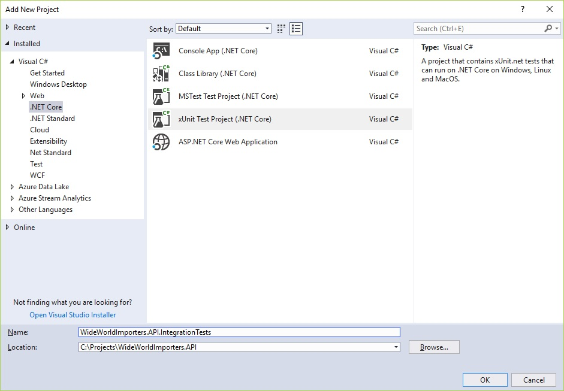

Manage references for WideWorldImporters.API.IntegrationTests project:

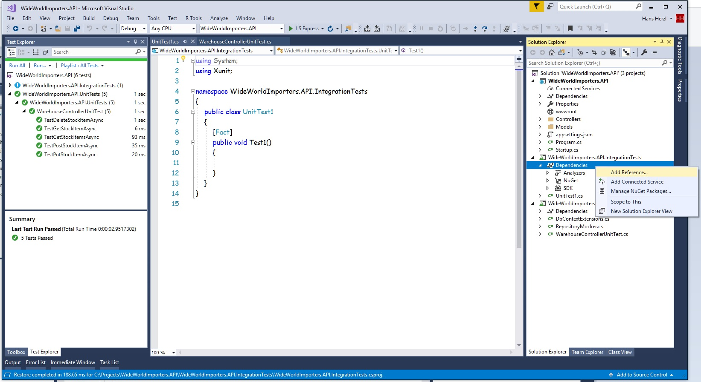

Now add a reference for WideWorldImporters.API project:

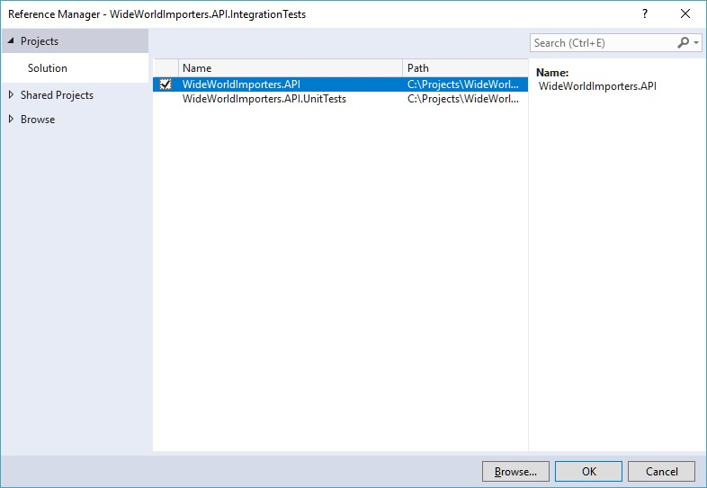

Once we have created the project, add the following NuGet packages for project:

    Microsoft.AspNetCore.Mvc
    Microsoft.AspNetCore.Mvc.Core
    Microsoft.AspNetCore.Diagnostics
    Microsoft.AspNetCore.TestHost
    Microsoft.Extensions.Configuration.Json

Remove UnitTest1.cs file.

Save changes and build WideWorldImporters.API.IntegrationTests project.

What is the difference between unit tests and integration tests? For unit tests, we simulate all dependencies for Web API project and for integration tests, we run a process that simulates Web API execution, this means Http requests.

Now we proceed to add code related for integration tests.

For this project, integration tests will perform Http requests, each Http request will perform operations to an existing database in SQL Server instance. We'll work with a local instance of SQL Server, this can change according to your working environment, I mean the scope for integration tests.

 Code for TestFixture.cs file

```csharp
using System;
using System.IO;
using System.Net.Http;
using System.Net.Http.Headers;
using System.Reflection;
using Microsoft.AspNetCore.Hosting;
using Microsoft.AspNetCore.Mvc.ApplicationParts;
using Microsoft.AspNetCore.Mvc.Controllers;
using Microsoft.AspNetCore.Mvc.ViewComponents;
using Microsoft.AspNetCore.TestHost;
using Microsoft.Extensions.Configuration;
using Microsoft.Extensions.DependencyInjection;

namespace WideWorldImporters.API.IntegrationTests
{
    public class TestFixture<TStartup> : IDisposable
    {
        public static string GetProjectPath(string projectRelativePath, Assembly startupAssembly)
        {
            var projectName = startupAssembly.GetName().Name;

            var applicationBasePath = AppContext.BaseDirectory;

            var directoryInfo = new DirectoryInfo(applicationBasePath);

            do
            {
                directoryInfo = directoryInfo.Parent;

                var projectDirectoryInfo = new DirectoryInfo(Path.Combine(directoryInfo.FullName, projectRelativePath));

                if (projectDirectoryInfo.Exists)
                    if (new FileInfo(Path.Combine(projectDirectoryInfo.FullName, projectName, $"{projectName}.csproj")).Exists)
                        return Path.Combine(projectDirectoryInfo.FullName, projectName);
            }
            while (directoryInfo.Parent != null);

            throw new Exception($"Project root could not be located using the application root {applicationBasePath}.");
        }

        private TestServer Server;

        public TestFixture()
            : this(Path.Combine(""))
        {
        }

        protected TestFixture(string relativeTargetProjectParentDir)
        {
            var startupAssembly = typeof(TStartup).GetTypeInfo().Assembly;
            var contentRoot = GetProjectPath(relativeTargetProjectParentDir, startupAssembly);

            var configurationBuilder = new ConfigurationBuilder()
                .SetBasePath(contentRoot)
                .AddJsonFile("appsettings.json");

            var webHostBuilder = new WebHostBuilder()
                .UseContentRoot(contentRoot)
                .ConfigureServices(InitializeServices)
                .UseConfiguration(configurationBuilder.Build())
                .UseEnvironment("Development")
                .UseStartup(typeof(TStartup));

            Server = new TestServer(webHostBuilder);

            Client = Server.CreateClient();
            Client.BaseAddress = new Uri("http://localhost:1234");
            Client.DefaultRequestHeaders.Accept.Clear();
            Client.DefaultRequestHeaders.Accept.Add(new MediaTypeWithQualityHeaderValue("application/json"));
        }

        public void Dispose()
        {
            Client.Dispose();
            Server.Dispose();
        }

        public HttpClient Client { get; }

        protected virtual void InitializeServices(IServiceCollection services)
        {
            var startupAssembly = typeof(TStartup).GetTypeInfo().Assembly;

            var manager = new ApplicationPartManager();

            manager.ApplicationParts.Add(new AssemblyPart(startupAssembly));
            manager.FeatureProviders.Add(new ControllerFeatureProvider());
            manager.FeatureProviders.Add(new ViewComponentFeatureProvider());

            services.AddSingleton(manager);
        }
    }
}
```

Code for ContentHelper.cs file:

```csharp
using System.Net.Http;
using System.Text;
using Newtonsoft.Json;

namespace WideWorldImporters.API.IntegrationTests
{
    public static class ContentHelper
    {
        public static StringContent GetStringContent(object obj)
            => new StringContent(JsonConvert.SerializeObject(obj), Encoding.Default, "application/json");
    }
}
```

Code for WarehouseTests.cs file:

```csharp
using System;
using System.Net.Http;
using System.Threading.Tasks;
using Newtonsoft.Json;
using WideWorldImporters.API.Models;
using Xunit;

namespace WideWorldImporters.API.IntegrationTests
{
    public class WarehouseTests : IClassFixture<TestFixture<Startup>>
    {
        private HttpClient Client;

        public WarehouseTests(TestFixture<Startup> fixture)
        {
            Client = fixture.Client;
        }

        [Fact]
        public async Task TestGetStockItemsAsync()
        {
            // Arrange
            var request = "/api/v1/Warehouse/StockItem";

            // Act
            var response = await Client.GetAsync(request);
            var value = await response.Content.ReadAsStringAsync();

            // Assert
            response.EnsureSuccessStatusCode();
        }

        [Fact]
        public async Task TestGetStockItemAsync()
        {
            // Arrange
            var request = "/api/v1/Warehouse/StockItem/1";

            // Act
            var response = await Client.GetAsync(request);
            var value = await response.Content.ReadAsStringAsync();

            // Assert
            response.EnsureSuccessStatusCode();
        }

        [Fact]
        public async Task TestPostStockItemAsync()
        {
            // Arrange
            var request = "/api/v1/Warehouse/StockItem";
            var requestModel = new
            {
                StockItemName = string.Format("USB anime flash drive - Vegeta {0}", Guid.NewGuid()),
                SupplierID = 12,
                UnitPackageID = 7,
                OuterPackageID = 7,
                LeadTimeDays = 14,
                QuantityPerOuter = 1,
                IsChillerStock = false,
                TaxRate = 15.000m,
                UnitPrice = 32.00m,
                RecommendedRetailPrice = 47.84m,
                TypicalWeightPerUnit = 0.050m,
                CustomFields = "{ \"CountryOfManufacture\": \"Japan\", \"Tags\": [\"32GB\",\"USB Powered\"] }",
                Tags = "[\"32GB\",\"USB Powered\"]",
                SearchDetails = "USB anime flash drive - Vegeta",
                LastEditedBy = 1,
                ValidFrom = DateTime.Now,
                ValidTo = DateTime.Now.AddYears(5)
            };

            // Act
            var response = await Client.PostAsync(request, ContentHelper.GetStringContent(requestModel));
            var value = await response.Content.ReadAsStringAsync();

            // Assert
            response.EnsureSuccessStatusCode();
        }

        [Fact]
        public async Task TestPutStockItemAsync()
        {
            // Arrange
            var requestUrl = "/api/v1/Warehouse/StockItem/1";
            var requestModel = new
            {
                StockItemName = string.Format("USB anime flash drive - Vegeta {0}", Guid.NewGuid()),
                SupplierID = 12,
                Color = 3,
                UnitPrice = 39.00m
            };

            // Act
            var response = await Client.PutAsync(requestUrl, ContentHelper.GetStringContent(requestModel));
            var value = await response.Content.ReadAsStringAsync();

            // Assert
            response.EnsureSuccessStatusCode();
        }

        [Fact]
        public async Task TestDeleteStockItemAsync()
        {
            // Arrange
            var postRequest = "/api/v1/Warehouse/StockItem";
            var requestModel = new
            {
                StockItemName = string.Format("Product to delete {0}", Guid.NewGuid()),
                SupplierID = 12,
                UnitPackageID = 7,
                OuterPackageID = 7,
                LeadTimeDays = 14,
                QuantityPerOuter = 1,
                IsChillerStock = false,
                TaxRate = 10.000m,
                UnitPrice = 10.00m,
                RecommendedRetailPrice = 47.84m,
                TypicalWeightPerUnit = 0.050m,
                CustomFields = "{ \"CountryOfManufacture\": \"USA\", \"Tags\": [\"Sample\"] }",
                Tags = "[\"Sample\"]",
                SearchDetails = "Product to delete",
                LastEditedBy = 1,
                ValidFrom = DateTime.Now,
                ValidTo = DateTime.Now.AddYears(5)
            };

            // Act
            var postResponse = await Client.PostAsync(postRequest, ContentHelper.GetStringContent(requestModel));
            var jsonFromPostResponse = await postResponse.Content.ReadAsStringAsync();

            var singleResponse = JsonConvert.DeserializeObject<SingleResponse<StockItem>>(jsonFromPostResponse);

            var deleteResponse = await Client.DeleteAsync(string.Format("/api/v1/Warehouse/StockItem/{0}", singleResponse.Model.StockItemID));

            // Assert
            postResponse.EnsureSuccessStatusCode();
            Assert.False(singleResponse.DidError);
            deleteResponse.EnsureSuccessStatusCode();
        }
    }
}

```

As we can see, WarehouseTests contain all tests for Web API, these are the methods:

|Methods|Description|
|-------|-----------|
|TestGetStockItemsAsync|Retrieves the stock items|
|TestGetStockItemAsync|Retrieves an existing stock item by ID|
|TestPostStockItemAsync|Creates a new stock item|
|TestPutStockItemAsync|Updates an existing stock item|
|TestDeleteStockItemAsync|Deletes an existing stock item|

How Integration Tests Work?

TestFixture<TStartup> class provides a Http client for Web API, uses Startup class from project as reference to apply configurations for client.

WarehouseTests class contains all methods to send Http requests for Web API, the port number for Http client is 1234.

ContentHelper class contains a helper method to create StringContent from request model as JSON, this applies for POST and PUT requests.

The process for integration tests is:

    The Http client in created in class constructor
    Define the request: url and request model (if applies)
    Send the request
    Get the value from response
    Ensure response has success status

Running Integration Tests

Save all changes and build WideWorldImporters.API.IntegrationTests project, test explorer will show all tests in project:

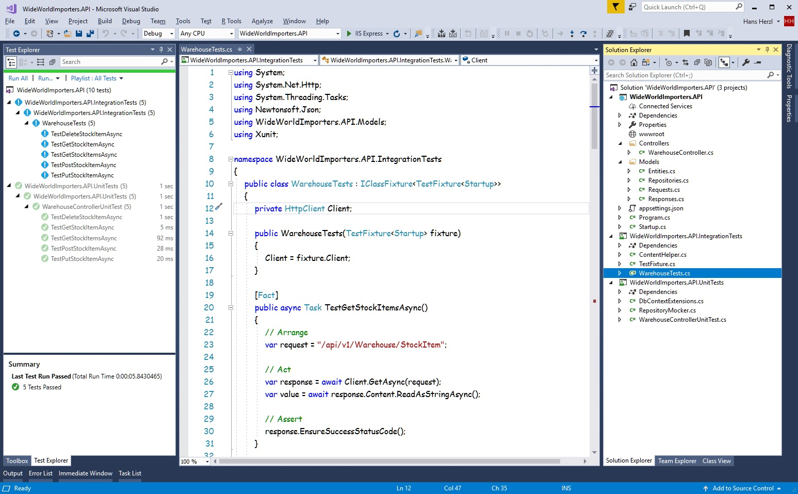

Keep in mind: To execute integration tests, you need to have running an instance of SQL Server, the connection string in appsettings.json file will be used to establish connection with SQL Server.

Now run all integration tests, the test explorer looks like the following image:

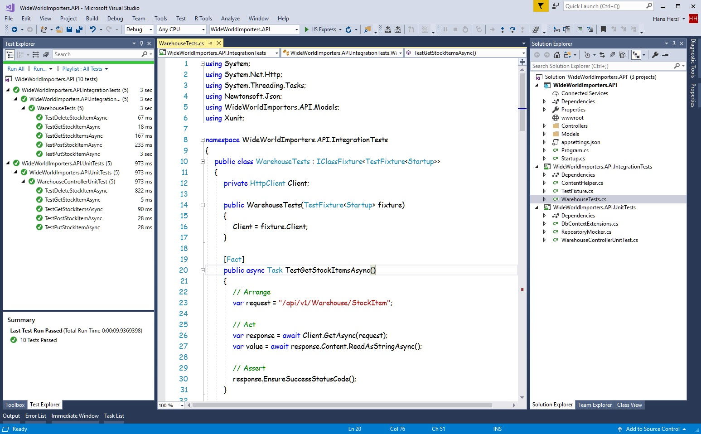

If you get any error executing integration tests, check the error message, review code and repeat the process.

## Code Challenge

## Code Improvements

    Explain how to use command line for .NET Core
    Add help page for Web API
    Add Security (Authentication and authorization) for API
    Split models definitions in files
    Refact models outside of Web API project
    Anything else? Let me know in the comments :)

## Points of Interest

    In this article, we're working with Entity Framework Core.
    Entity Framework Core has in memory database.
    We can adjust all repositories to expose specific operations, in some cases, we don't want to have GetAll, Add, Update or Delete operations.
    Unit tests perform testing for Assemblies.
    Integration tests perform testing for Http requests.
    All tests have been created with xUnit framework.

### Related Links

*[`Unit testing C# in .NET Core using dotnet test and xUnit`](https://docs.microsoft.com/en-us/dotnet/core/testing/unit-testing-with-dotnet-test?view=aspnetcore-2.1)
* [`Integration tests in ASP.NET Core`](https://docs.microsoft.com/en-us/aspnet/core/test/integration-tests?view=aspnetcore-2.1)

## History

* November 1st, 2018: Initial Version

